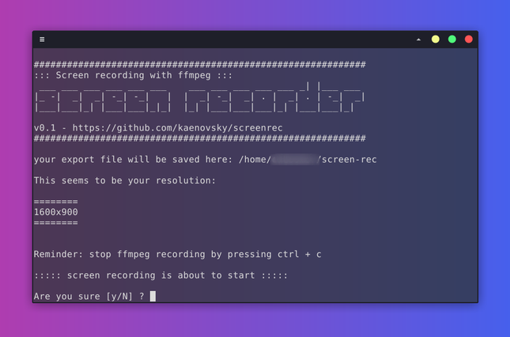

# Screen Recorder with ffmpeg
This simple cli tool is for recording your own Linux screen using ffmpeg. 



The main command is this one:

```Bash
ffmpeg -y -video_size $checkScreenSize -loglevel error -framerate 30 -f x11grab -i $DISPLAY+0,0 -c:v libx264 -qp 0 -preset ultrafast $DIR/output`date +%H%M%S`.mp4
```

As you can see ```ffmpeg``` is doing all the heavy work here. I used to have a command similar to this one as an alias without the 'checkScreenSize' variable and that was a problem every time I had to change my monitor or if I happen to have a different resolution at the moment. So with this bash script you can rely on ```xdpyinfo``` to get your screen resolution before starting to record.

It will also create a new directory if not present already.

In order to use this yourself on Linux, make sure you have ffmpeg installed:
```
ffmpeg -version
```
Then get the script with:
```
wget https://raw.githubusercontent.com/kaenovsky/screenrec/main/screenrec.sh
```
Make it executable:
```
sudo chmod +x ./screenrec.sh
```
And run it:
```
./screenrec.sh
```
First time you run this it will create a new directory inside your user's home directory to save your files there.

Feel free to change any of the variables to get your recorded videos however you want them or changing the output directory.